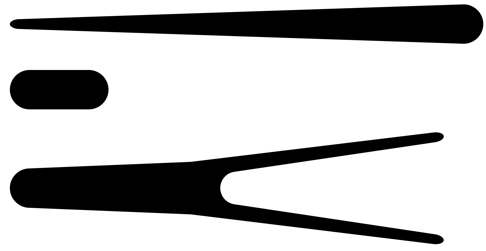

In 2021 I developed high-resolution versions of the Seabreeze
"arrow" and "fin" on the bow and stern ends of the cove stripe. These can be easily
printed out as stencils or as vinyl decals from BoatUS.

{: .imgwrap :}

**Caveat:** I developed the artwork by manually tracing directly from hull #62---when
she was over 50 years old. It is not the original artwork, and it may
not match what's on your boat.

There are 3 files; choose the ones that best suit your needs:

* [Ornaments only]({{site.docs}}/seabreeze-cove-stripe-ornaments.pdf)
* [Position ready]({{site.docs}}/seabreeze-cove-stripe-position.pdf)
  spaced relative to each other, as they appear on the hull
* [Reversed]({{site.docs}}/seabreeze-cove-stripe-reverse.pdf)
  negative (knockout) image of the previous file

If you print these make sure to print at 100% (not "fit to page" or any other scale
option) or they won't be the right size.

[BoatUS Lettering](https://www.boatus.com/products-and-services/boat-lettering)
already has the artwork in their system as order #224503. You can order
these as decals for a very reasonable price and apply them as you would lettering.
The BoatUS color palette
is very close to the "Awlgrip" paint catalog used by major paint manufacturers, which
means you can usually order decals to match a painted cove or boot stripe.

