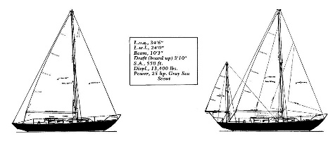

## Welcome! ##

Welcome to the website for the **Allied Seabreeze Owners Association** (ASOA).
This website provides a place for current and former owners of the
Seabreeze 35 to share information, learn more about their boats, and
meet other owners.

This site was recently relaunched to provide updated content and a modern,
mobile-friendly user experience. The [previous site is available here](http://archive.alliedseabreeze35.org).

## ASOA On Facebook ##

The [ASOA Facebook Group][fb]
is the primary forum for Seabreeze lovers to talk online and share information and photos.

## Contact Information ##

To contact the ASOA, email <{{ site.email }}> or join the [Facebook group][fb].

**Attention Seabreeze Owners!** If you are the proud owner of a Seabreeze
in any condition and have not joined the ASOA, please reach out via
the links above. The ASOA makes a valiant effort to track the condition,
location, and ownership of each of these fine boats, but we can't do it without
your help. You can access the [online database here]({{site.db_url}}) or
<a target=_blank href="{{site.db_update_form}}">use our online form</a>
to provide updated information about boats and ownership.
{: .attn .border .border-info .bg-info .bg-opacity-10 .rounded-start .rounded-end :}

## About the Seabreeze 35 ##

, former owner #65"){: .float :}

The [Allied Seabreeze](https://sailboatdata.com/sailboat/seabreeze-35-allied)
was designed by [MacLear & Harris](https://sailboatdata.com/designer/maclear-harris)
in 1962. A total of 135
of these magnificant boats were built between 1963 and 1972. Of these, we know
of only five boats that no longer exist. One is known to have been destroyed on
a reef in the South Pacific and the other was scraped after surviving a fire
and was considered to be too much of a project to restore. The remainder of
these boats, many belonging to members of the Association, are actively sailed
or are being refurbished or restored for future sailing.

In an interview, Frank MacLear said the boat was designed to be sailed anywhere
in the world. She is a small boat at 34.5 feet overall, but a worthy passage
maker. Beyond her seakindly and lovely sailing characteristics, she is a beauty
to behold. She was designed by very capable naval architects and built by a
company with impeccable credentials. Her hull and deck are solid and her
interior thoughtfully laid out.

As a centerboarder, she is capable of safely traversing shoal waters, gunk
holing remote regions, enjoying anchorages impossible for boats of deeper
drafts, and searching far up stream for more secure harbors and refuge from
approaching storms. At sea she is stable and comfortable, but as a
centerboarder, the capable sailor will know to reduce sail earlier than on
deeper keeled boats.

[fb]: https://www.facebook.com/groups/1381759918520532
