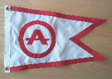
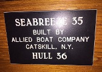

# Members Area #

## Contents ##

* [ASOA Database](#asoa-database)
* [ASOA Burgee](#asoa-burgee)
* [Seabreeze Hull # Replacement Plaques](#hull-plaques)
* [Maine Rendezvous 2015](http://alliedseabreeze.zognet.net/Events.html)

----

### ASOA Database ###

The ASOA makes a good faith effort to maintain an up-to-date list of Seabreeze
sailboats, their owners, locations, and current status. Access is available to
ASOA members only. Contact <{{ site.email }}> to gain access or provide updates/corrections.

{: .float.small :}

### ASOA Burgee ###

12" x 18" burgees are available again on a limited basis for $30.00. To order one,
send an email to <{{ site.email }}>.

{: .float.small :}

### Seabreeze Hull # Replacement Plaques ### {#hull-plaques}

Although we believe each Seabreeze came with a builder's plaque that has your hull number engraved on it, many of these plaques have been lost over the years. The plaque was not permanently affixed and on some boats are missing. If you are not sure of your hull number, there is a reliable way to look for your lost number. As the components came down the assembly line, most had their hull number penciled on the raw plywood, like the varnished draw bottoms, door edges and other varnished surfaces may reveal your hull number.

Art Hall, our ASOA President, has been in touch with a trophy shop in Maine that can make up a new hull number plaque for probably under $20.00 including shipping.

Please contact this shop directly and NOT Art Hall. You can send them a picture of Art's plaque and have them change the hull number to your boat's number. Here's the shop information to contact them:

[Accolades Awards and Trophies](http://www.accolades4me.com)  
207-725-8980

Many thanks to Art for looking into this for us and the writing the article [How to Identify Seabreeze Hull Numbers][article].

[article]: _PDF_/How%20to%20identify%20Seabreeze%20Hull%20Numbers.pdf
